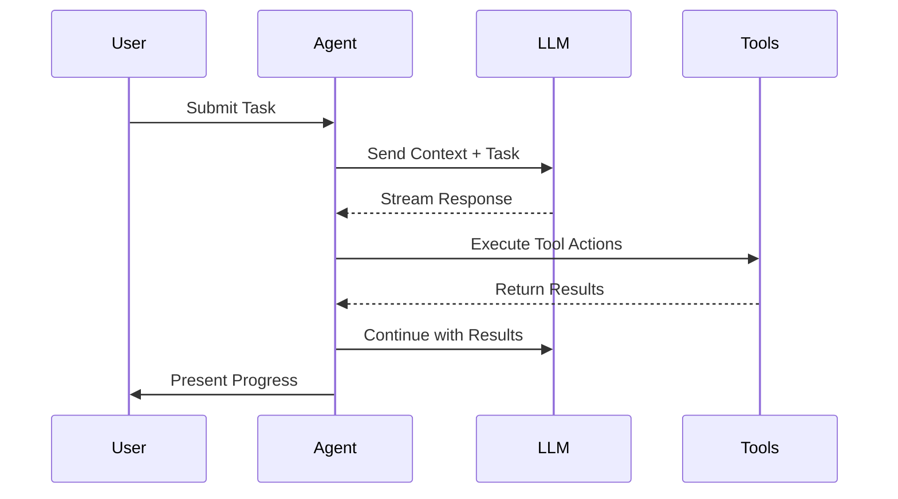
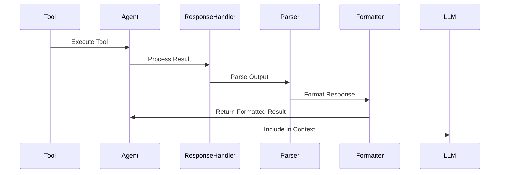

# Cline Agent Architecture Documentation

## Table of Contents
- [Overview](#overview)
- [Core Architecture](#core-architecture)
- [Tool System](#tool-system)
- [Task Execution Flow](#task-execution-flow)
- [Development Tools](#development-tools)
- [Response Handling](#response-handling)
- [Error Handling](#error-handling)

## Overview

Cline is an advanced LLM Agent implementation that can automatically build applications, perform coding tasks, and develop programs. It operates through a sophisticated architecture combining language model capabilities with system tools and state management.

## Core Architecture

```mermaid
graph TB
    subgraph Core["Core Agent System"]
        Agent["Agent Class (Main Controller)"]
        TaskExecution["Task Execution Loop"]
        ToolSystem["Tool System"]
        StateManagement["State Management"]
        DebugSession["Debug Session"]
        AgentLogger["Agent Logger"]
    end

    subgraph ToolSystem["Tool System"]
        FileTools["File Operations"]
        # CodeAnalysis["Code Analysis"] # Removed: Not currently implemented as a separate toolset
        # Terminal["Terminal Management"] # Removed: Not currently implemented as a separate toolset
        # Browser["Browser Automation"]  # Removed: Not currently implemented as a separate toolset
    end

    subgraph StateManagement["State Management"]
        TaskState["Task State"]
        StateStorage["State Storage (JSON, SQLite)"]
        Checkpoints["State Checkpoints"]
        # History["Task History"] # Removed: Task history is part of TaskState/StateStorage
    end

    subgraph Integration
        VSCode["VSCode Extension (External UI)"]
        LLMProviders["LLM API Providers (OpenAI)"]
        # MCP["Model Context Protocol"] # Removed: Not currently integrated yet
    end

    Agent --> TaskExecution
    TaskExecution --> ToolSystem
    ToolSystem --> StateManagement
    StateManagement --> AgentLogger
    DebugSession --> Agent
    LLMProviders --> Agent
    VSCode --> Agent

    style Agent fill:#f9f,stroke:#333,stroke-width:2px
    style TaskExecution fill:#ccf,stroke:#333,stroke-width:2px
    style ToolSystem fill:#cfc,stroke:#333,stroke-width:2px
    style StateManagement fill:#ffc,stroke:#333,stroke-width:2px
    style DebugSession fill:#eee,stroke:#333,stroke-width:2px
    style AgentLogger fill:#eee,stroke:#333,stroke-width:2px
    style LLMProviders fill:#bbf,stroke:#333,stroke-width:2px
    style VSCode fill:#bbf,stroke:#333,stroke-width:2px
```

### Key Components

1.  **Agent Class (Main Controller)**
    -   Central orchestrator for task execution.
    -   Manages the main task execution loop.
    -   Handles interactions with LLM providers and tool system.
    -   Manages agent state and persistence using `StateManagement`.
    -   Integrates with `DebugSession` for debugging and `AgentLogger` for logging.

2.  **Task Execution Loop**
    -   Iterative process for executing tasks.
    -   Steps include: getting actions from LLM, executing tools, updating state, and checking for completion.
    -   Designed to be robust and handle interruptions and errors.

3.  **Tool System**
    -   Modular system for extending agent capabilities.
    -   Currently includes `File Operations` tools for file system interactions.
    -   Tools are designed to be reusable and easily extensible.

4.  **State Management**
    -   Handles the agent's state throughout task execution.
    -   Uses `TaskState` to track task-specific information.
    -   Provides `StateStorage` implementations (JSON, SQLite) for persistence.
    -   Supports state checkpoints for saving intermediate states.

5.  **Debug Session**
    -   Provides debugging capabilities for agent development.
    -   Allows setting breakpoints at different stages of task execution (LLM, Tool, State).
    -   Supports step-by-step execution and debug callbacks.

6.  **Agent Logger**
    -   Provides logging functionality for agent activities.
    -   Configurable logging levels and output file.

7.  **Integration Layer**
    -   **VSCode Extension**: External UI for interacting with the agent (not part of the core `llm_agent` package).
    -   **LLM API Providers**: Integrations with LLM APIs like OpenAI (currently mock implementation).
    -   **MCP (Model Context Protocol)**: (Commented out/removed from diagram) Planned future integration for extensible tools and resources. Not yet implemented.

## Tool System

```mermaid
graph TB
    Agent[Agent Core]
    
    subgraph FileTools[File Management Tools]
        WriteFile[write_file]
        ReadFile[read_file]
        SearchFiles[search_files]
        ListFiles[list_files]
    end
    
    # subgraph CodeTools[Code Analysis Tools] # Removed: Not currently implemented
    #    CodeDefs[list_code_definition_names]
    # end
    
    # subgraph TerminalTools[Terminal Management] # Removed: Not currently implemented
    #    ExecCommand[execute_command]
    #    OutputStream[Output Streaming]
    #    ProcessMgmt[Process Management]
    # end

    Agent --> FileTools
    # Agent --> CodeTools # Removed: Not currently implemented
    # Agent --> TerminalTools # Removed: Not currently implemented

    # WriteFile --> DiffView[Diff View Provider] # Removed: Diff View Provider not part of llm_agent package
    # ReplaceFile --> DiffView # Removed: Diff View Provider not part of llm_agent package
    
    # ExecCommand --> TerminalMgr[Terminal Manager] # Removed: Terminal Manager not part of llm_agent package
    # TerminalMgr --> OutputStream # Removed: Output Stream not part of llm_agent package
```

### Development Tools

#### 1. File Tools

##### write_file
Tool for creating new files or overwriting existing ones:

```typescript
interface WriteFileParams {
  path: string;      // Target file path
  content: string;   // Complete file content
}
```

Key features:
- Creates new or overwrites existing files
- Automatically creates directories if needed
- Handles code formatting
- Creates Git checkpoints after changes

##### read_file
Tool for reading file contents:

```typescript
interface ReadFileParams {
  path: string;      // Target file path
}
```

Key features:
- Reads content of a file at the specified path.
- Supports various text file formats.

##### search_files
Tool for searching files by pattern:

```typescript
interface SearchFilesParams {
  directory: string; // Directory to search in
  pattern: string;   // Search pattern
  recursive: boolean; // Recursive search flag
}
```

Key features:
- Searches for files matching a given pattern within a directory.
- Supports recursive and non-recursive search.

##### list_files
Tool for listing files in a directory:

```typescript
interface ListFilesParams {
  directory: string; // Directory to list files in
  recursive: boolean; // Recursive listing flag
}
```

Key features:
- Lists files in a specified directory.
- Supports recursive and non-recursive listing.

## Task Execution Flow



## Response Handling

### Tool Response Processing Pipeline



### Content Block Structure

```typescript
interface ToolResponse {
    type: "text" | "tool_result";
    content: string;
    images?: string[];  // For visual output
}
```

### State Management During Tool Use
- Conversation history maintenance
- Tool execution status tracking
- Partial response handling
- Error state management

## Error Handling

```typescript
async handleError(action: string, error: Error) {
    // 1. Format error message
    const errorString = `Error ${action}: ${error.message}`;
    
    // 2. Log the error
    console.error(errorString);
    
    // 3. [Optional] Notify user or external system
    // notifyUser(errorString); 
    
    // 4. [Optional] Attempt resource cleanup or state recovery
    // cleanupResources();
    // revertState();
}
```

### Error Recovery Process
1.  **Error Detection and Logging**: Identify and log errors with detailed messages.
2.  **Resource Cleanup**: Ensure resources are properly released or reverted to a stable state.
3.  **State Preservation**: Maintain or revert the agent's state to a consistent point.
4.  **User Notification**: Inform the user about the error and potential next steps.
5.  **Recovery Path Determination**: Decide if the agent can automatically recover or requires external intervention.

## Agent Mode System

The agent operates in two distinct modes:

### 1. Plan Mode
- Focus on information gathering
- Task analysis and planning
- User consultation and clarification
- Architecture and solution design

### 2. Act Mode
- Active tool usage
- Code modification
- Command execution
- Task implementation

### Mode Switching
- User-controlled mode switching
- Context preservation between modes
- State management during transitions

## Extensibility

### MCP (Model Context Protocol)
- Custom tool creation
- API integration
- Resource management
- Server-based extensions

### API Provider Support
- Multiple LLM backend support
- Provider-specific optimizations
- Context window management
- Token usage tracking

## System Prompt Structure

### 1. Core Instructions
- Tool usage guidelines
- Context window management
- Error handling protocols
- Operation rules

### 2. Environmental Context
- Working directory information
- File system state
- Terminal status
- Editor state

### 3. Tool Definitions
- Available tools and parameters
- Usage restrictions
- Safety guidelines
- Implementation details

### 4. Operational Rules
- Step-by-step execution
- Approval requirements
- State management
- Safety protocols
